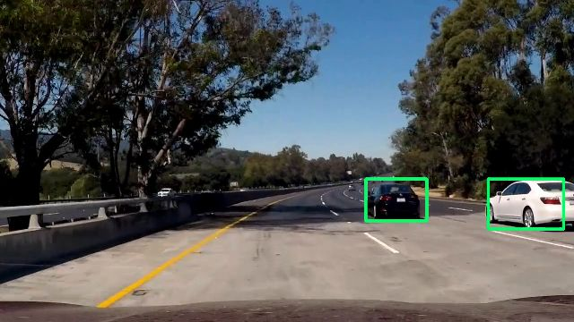
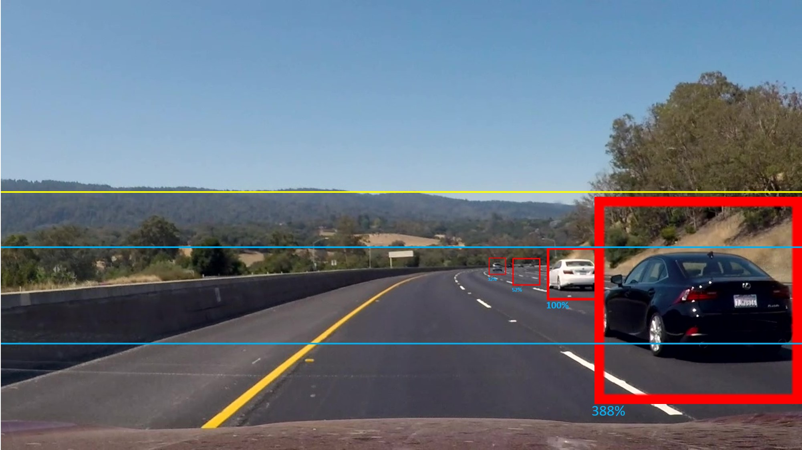
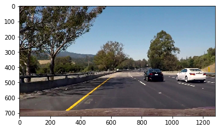
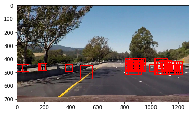
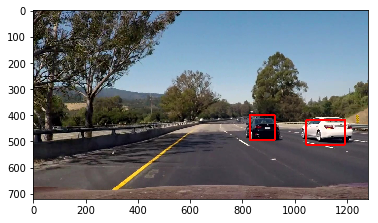

# Vehicle Detection #

The objective of this project is to detect and highlight vehicles in a video stream, captured from dashcam of a car.

## Code ##
Please refer to the following notebooks for the code for this project:

- Main project pipeline: "Vehicle Detection.ipynb"
- Classifier building, training and testing: "Classifier_building (feature extract, parameter tune, train).ipynb"
- Test on reference images for frame and scale selection: "VD - Scale and frame refinement.ipynb"

## Process ##
The entire process of vehicle detection using feature engineering and machine learning method may be summarized as below:

### Training: Feature Extraction ###
1. Get HOG features
2. Get Color histograms
3. Get Spatial features (raw pixels)
4. Get data and corresponding lables and split into train/test set
5. Get and combine features for above
6. Train classifier
7. Test classifier

#### HOG Features: ####
Histogram of oriented gradients is a feature extraction method in which the target image is divided into cells of pixels and blocks of cells. A directional gradient in each cell is calculated and saved as a its histogram, in a defined set of orientations. These histograms have proven to be useful features when used with a ML classifier to classify objects of interest.

It is important to note that HOG extractor works on one channel and produces different results for different color schemes. This project use all three channels of the HLS representation in the pipeline and concatenates them.

We use the *skimage.feature* library's *hog* function to extract HOG features of training and testing data. 

#### Spatial and Histogram Features: ####
To supplement HOG features, we try to incoporate a feature with spatial information of the colors used. A 32x32 downsized version of the original images is used as a spatial features when flattened.

A color histogram of the original image is also used as it contains useful information that can be used by the classifier to distinguish cars from non-cars.

The following parametres were passed to the extractor:

- color_space='HLS'
- spatial_size=(32, 32)
- hist_bins=16
- orient=9
- pix_per_cell=6
- cell_per_block=2
- hog_channel='ALL'
- spatial_feat=True
- hist_feat=True
- hog_feat=True

#### Classifier  - Selection, train and test ####

For this project, I have tried and tested a few major ML classifiers:
- SVM: these turned out to be the most accurate (0.993) but also the slowest of them all. I used this classifier since it produced the least number of false positives when compared to the other classifiers, incurring very long classification processing times.
- Random Forest: Although using this ensemble decision tree performed very fast expecially compared to SVMs, RandomForest also predicted a really high number of false positives (0.966), that couldn't easily be filtered in the later part of the process pipeline.
- GaussianNB and AdaBoost: both of these didn't have sufficient accuracy (0.945 and 0.96 respectively) to be reliably used in the pipeline.

**Scaling:**
Since the feature set was a combination of 3 seperate feature extractions, it had varied scale and this does not work well with classifier. Hence I used a *StandardScaler* from the *sklearn* library to standardize the feature distribution.
The Scaler used was *fit* on the training dataset and used to transform test and pipeline (video) images.

**PCA:**
There were over 8000 features per 64x64 image, which were causing the SVM to classify at a very low pace. Since not all features are of equal importance to the performance of the classifier, I performed Principal Component Ananlysis of the feature set and retain only the top 600 features.

The PCA object, scaler and the trained SVM object was saved in a pickle file, to be applied to the video pipeline later.

Please refer to the following notebook to see the code used to build the classifier and select the parametres for feature extraction using gridsearch:
"Classifier_building (feature extract, parameter tune, train).ipynb"

### Detection - Images ###

Summary:
1. Select areas of interest
2. Select scaling factors for performing the search on
3. Get HOG features for entire scaled image
4. Get other features for window of image
5. Subsample (3) and combine with (4) to get features vector
6. Predict on feature vector and record location
7. Combine detections using heatmap method
8. Draw detection windows on original image

Next, we apply our classifier to some test images, to gauge the best scaling and cropping parameters.

In theory, we would need to operate our classifier on four scales: 4x, 1x, 0.5x and 0.3x, working with cropped sections as shown below:

However, by playing around with different scales and image crop locations, only the two below configurations were sufficient to detect vehicles in reasonable forward vicinity:

- ystart=415, ystop=500, scale=0.8
- ystart=400, ystop=550, scale=1.5

SVM takes considerable amount of time to return the results while making a few misclassifications.

In order to minimize the processor time and effort in extracting features, we run the HOG extraction for the full image (give the ystart/ystop point and the scale) and then select the appropriate number of cells across the HOG matrix thus generated.

** Heatmap and labelling: **
Once our classifier has returned a list possible suspects, we need to combine and suppress repeated detections and eliminate false positives. We do this by creating a 'heatmap', where the areas under each detection bounding box is incremented in its pixel value and the others are kept zeros. This creates areas of high overlap with higher pixel values. 
By thresholding at a certain value (I've used threshold > 1), areas of interest are kept while rest of the detections are discarded.
Once we have the 'hot' areas on the image marked, it is time to label each contigiuos block using sklearn's label function.
This way we have seperate detection bounding boxes.

It should be noted that we still won't be able eliminate all false positives at this stage. Temporal information is used in the video pipeline to alleviate this problem.

Example images:

   

Please refer to the following notebook to see the code used to test and select the parametres scaling and image section selection:
*"VD - Scale and frame refinement.ipynb"*

### Detection - Videos ###
1. Follow detection process as above (for images) for each frame
2. Augument step (7) above by checking previous frames for 'cool' detections and discard them (keeping only the 'hot' detections)

In order to minimize false positives on the output image, I averaged the labelled boxes over 20 previous frames and applied a threhold of (>19) to the heatmap thus generated to get a smoother detection window over each car in frame.
I also applied some 'growth' to the labelled boxes before combining them into one heatmap as explained above, in order to minimize splits within single detections and to make sure the detected car was captured fully.

Please refer to the following notebook to see the code used to test and select the parametres scaling and image section selection:
*"Vehicle Detection.ipynb"*

Final output video file: *project_video_output_6.mp4*

### Conclusion and further discussion ###

- The entire process, although simple in theory, was a tedious one. The pipeline depends and comprises of several components that need to be optimized individually, making it very hard and time consuming to tune the whole system.
- The classifier (SVM in this case) performs very slow and is unsuitable for real-time application unless it is optimized further and it is run on a better hardware. 

**Different approach:**
Several Deep learning approach have been proposed for object detection (like YOLO and SSD) that are fast enough for real-time application. I'm currently working on training a VGG+YOLO network on the Udacity (CrowdAI) dataset however, it still requires some work (particularly in the loss function definition) and time to complete (I didn't want to use the pre-trained weights from PASCAL dataset).  
